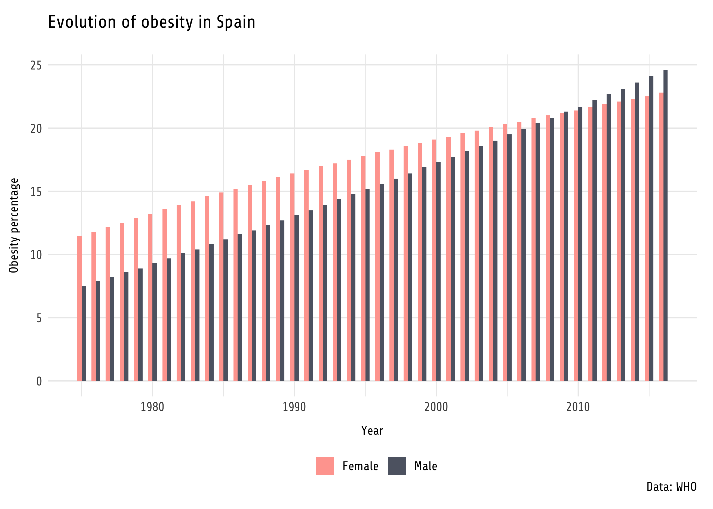
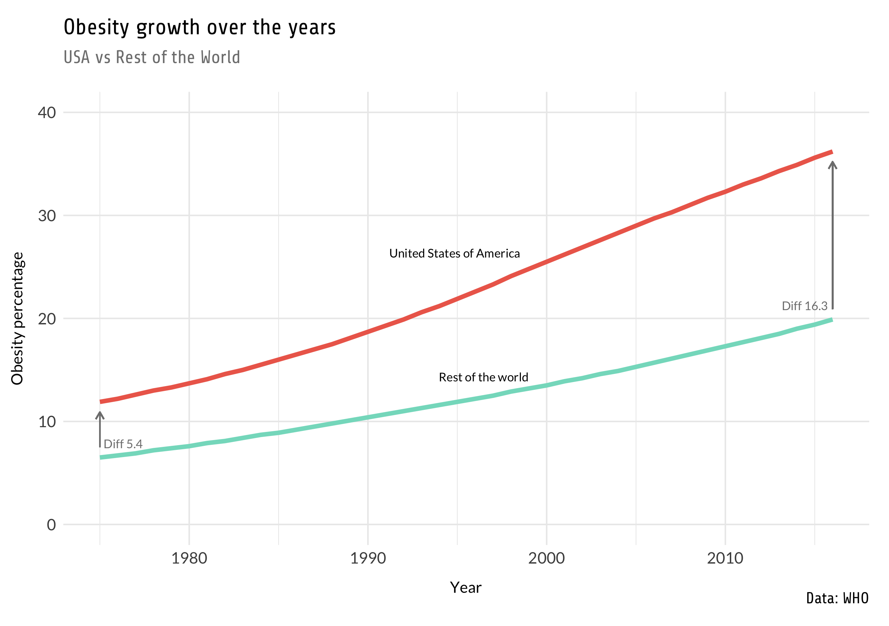

# 30 días de gráficos 2020

Siguiendo el [reto de ciencia de datos](https://github.com/cienciadedatos/datos-de-miercoles/blob/master/30-dias-de-graficos-2020.md)

## Día 1: Barras

- Datos: [Obesity percentage in the World](https://www.kaggle.com/amanarora/obesity-among-adults-by-country-19752016/)

## Día 2: Lineas

- Datos: [Obesity percentage in the World](https://www.kaggle.com/amanarora/obesity-among-adults-by-country-19752016/)

